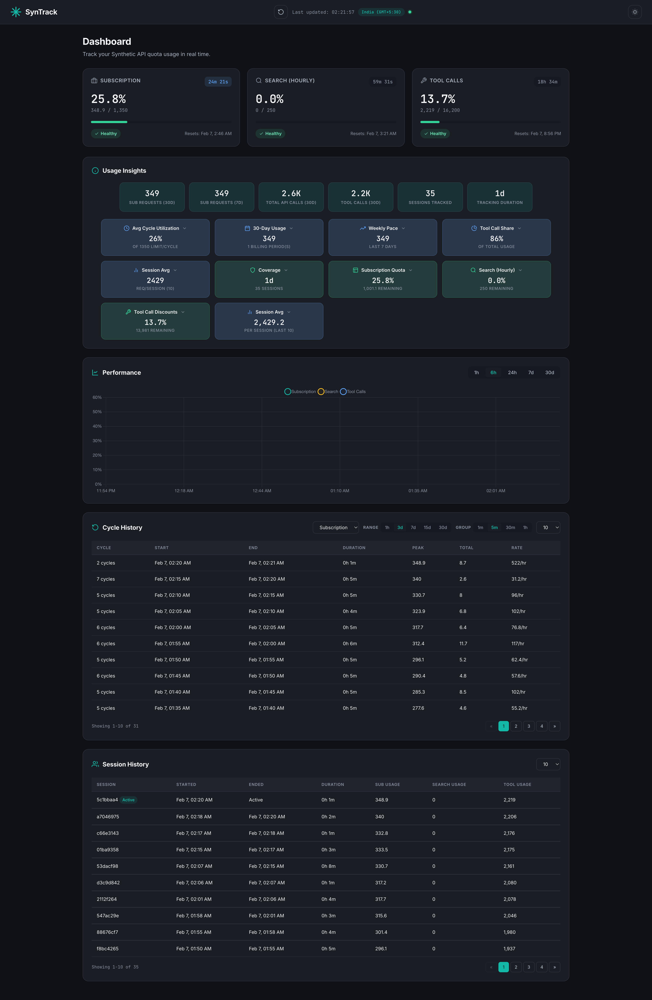

# SynTrack

Track your [Synthetic API](https://synthetic.new) usage. A lightweight background agent that polls quota data, stores it in SQLite, and serves a Material Design dashboard.



> Powered by [onllm.dev](https://onllm.dev)

---

## Why SynTrack

The Synthetic API shows current quota usage, but not historical trends or per-cycle consumption. SynTrack fills this gap:

- Track usage across reset cycles
- See which quotas approach limits
- Get projected usage before reset
- Monitor in real-time with live countdowns
- Run silently in the background (~10 MB RAM)

---

## Features

| Feature | Description |
|---------|-------------|
| Background polling | Polls `/v2/quotas` every 60 seconds (configurable) |
| Three quota types | Tracks subscription, search, and tool call discounts |
| Reset detection | Detects quota resets and tracks per-cycle usage |
| Live countdown | Real-time timers for all 3 quota types |
| Material Design 3 | Dashboard with dark and light mode |
| Time-series chart | Chart.js area chart with 1h, 6h, 24h, 7d, 30d ranges |
| Session tracking | Track consumption per agent session |
| SQLite storage | Append-only log, WAL mode |
| Single binary | No runtime dependencies |

---

## Quick Start

### 1. Download or Build

**Option A: Download release (macOS ARM64)**
```bash
curl -L -o syntrack https://github.com/onllm-dev/syntrack/releases/download/v1.0.0/syntrack-darwin-arm64
chmod +x syntrack
```

**Option B: Build from source**
```bash
git clone https://github.com/onllm-dev/syntrack.git
cd syntrack
go build -ldflags="-s -w" -o syntrack .
```

### 2. Configure

Copy the example environment file:

```bash
cp .env.example .env
```

Edit `.env` and set your API key:

```bash
# Get your API key from https://synthetic.new/settings/api
SYNTHETIC_API_KEY=syn_your_actual_key_here

# Change these for security
SYNTRACK_ADMIN_USER=admin
SYNTRACK_ADMIN_PASS=your_secure_password_here
```

**Required:** At minimum, set `SYNTHETIC_API_KEY`. All other values have sensible defaults.

### 3. Run

**Background mode (recommended for daily use):**
```bash
./syntrack
```
Logs go to `.syntrack.log` in the same directory.

**Foreground/debug mode (for troubleshooting):**
```bash
./syntrack --debug
```

**Custom settings:**
```bash
./syntrack --interval 30 --port 8080
```

### 4. View Dashboard

Open http://localhost:8932 in your browser and log in with the credentials from your `.env` file.

### 5. Check Logs

```bash
# Background mode
tail -f .syntrack.log

# Or view the log file directly
cat .syntrack.log
```

---

## CLI Options

| Flag | Env Var | Default | Description |
|------|---------|---------|-------------|
| `--interval` | `SYNTRACK_POLL_INTERVAL` | `60` | Polling interval in seconds (10-3600) |
| `--port` | `SYNTRACK_PORT` | `8932` | Dashboard HTTP port |
| `--db` | `SYNTRACK_DB_PATH` | `./syntrack.db` | SQLite database path |
| `--debug` | — | `false` | Run in foreground, log to stdout |
| `--version` | — | — | Print version and exit |

CLI flags override environment variables.

---

## Dashboard


### Quota Cards

Three cards showing subscription, search, and tool call quotas. Each displays:

- Current usage vs. limit with color-coded progress bar
- Live countdown to next reset
- Absolute reset time
- Status badge (healthy/warning/danger/critical)
- Consumption rate and projected usage

### Usage Insights

Plain English summaries like:

> "You've used 47.1% of your tool call quota. At current rate (~1,834 req/hr), projected ~12,102 before reset."

### Time-Series Chart

- Area chart showing all 3 quotas as percentages
- Time range selector: 1h, 6h, 24h, 7d, 30d
- Vertical markers at reset events

### Reset Cycle History

Table of completed cycles showing start/end times, peak usage, and total requests.

### Dark/Light Mode

- Toggle via sun/moon icon
- Detects system preference on first visit
- Persists across sessions

---

## Session Tracking

Each agent run creates a session with a unique UUID:

```
Session: a3f7c2d1-...  Started: Feb 6, 10:30 AM  Duration: 2h 15m
  Subscription: max 342 requests
  Search:       max 45 requests
  Tool Calls:   max 8,102 requests
  Snapshots:    135 polls recorded
```

The session tracks the maximum request count observed. This equals total consumption for that session.

---

## Architecture

```
┌──────────┐     ┌──────────┐     ┌──────────┐     ┌──────────┐
│ Synthetic │────>│  Agent   │────>│  Store   │<────│  Web     │
│ API       │     │ (poller) │     │ (SQLite) │     │ (server) │
└──────────┘     └──────────┘     └──────────┘     └──────────┘
  /v2/quotas       60s tick       WAL mode         :8932
```

**RAM budget:** ~10 MB idle, ~15 MB during dashboard render.

---

## API Endpoints

All endpoints require Basic Auth:

| Endpoint | Description |
|----------|-------------|
| `GET /api/current` | Latest snapshot with summaries |
| `GET /api/history?range=6h` | Historical data for charts |
| `GET /api/cycles?type=subscription` | Reset cycle history |
| `GET /api/summary` | Usage summaries for all quotas |
| `GET /api/sessions` | Session history |

---

## Development

### Prerequisites

- Go 1.22+
- No CGO required

### Commands

```bash
make test    # Run all tests with race detection
make build   # Build production binary
make run     # Build and run
make clean   # Remove artifacts
```

### Testing

- Tests written first (TDD)
- Table-driven tests
- Real SQLite (`:memory:`), no mocks
- Race detection enabled

---

## Security

- API keys loaded from `.env` (never committed)
- API keys redacted in logs
- HTTP Basic Auth with constant-time password comparison
- Parameterized SQL queries

---

## Contributing

1. Fork the repository
2. Create a feature branch: `git checkout -b feat/my-feature`
3. Write tests first
4. Run tests: `make test`
5. Commit with conventional format: `feat: add feature X`
6. Push and create a Pull Request

---

## License

MIT License. See [LICENSE](LICENSE).

---

## Acknowledgments

- Powered by [onllm.dev](https://onllm.dev)
- [Synthetic](https://synthetic.new) for the API
- [Chart.js](https://www.chartjs.org/) for charts
- [modernc.org/sqlite](https://pkg.go.dev/modernc.org/sqlite) for pure Go SQLite
